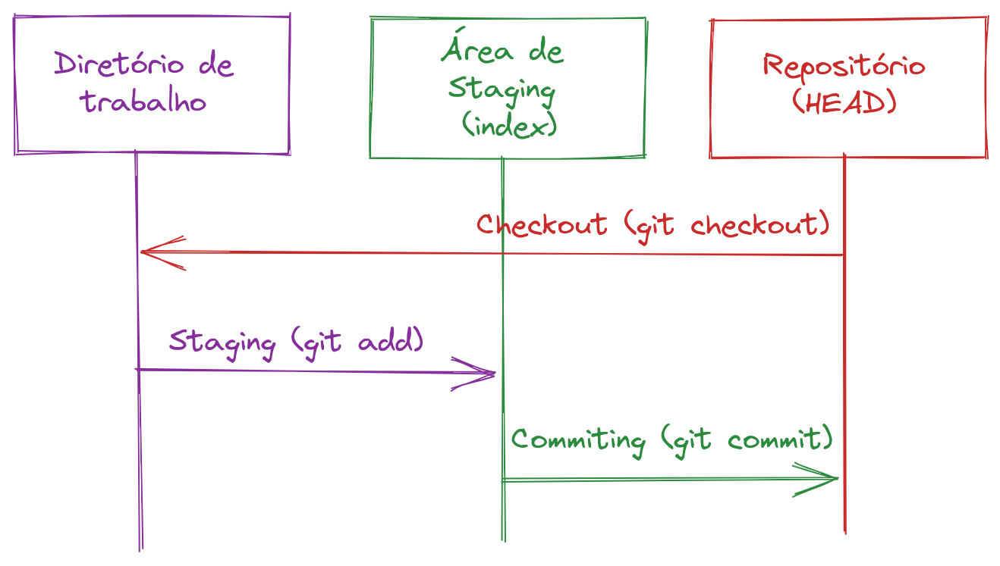
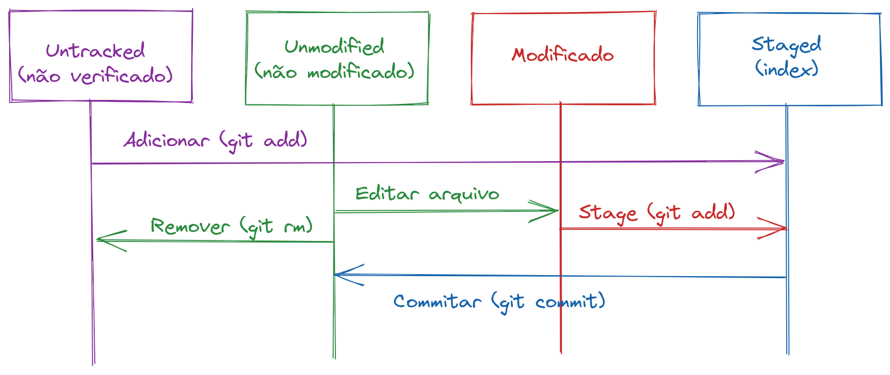

# <!--fit--> Introdução ao Git
### Prof. Diego Cirilo
Minicurso apresentado na III Expotec 
IFRN - Campus São Paulo do Potengi
2022

---


---
# Git

- Sistema de controle de versionamento gratuito e de código livre

## Versionamento
- Gerenciamento das mudanças nos documentos, programas, sites e outras coleções de informação.
- Disponibiliza um ambiente isolado para experimentos, sem riscos para o que já funciona.
- Essencial para colaboração eficiente.

---
# Git

- Desenvolvido por Linus Torvalds (criador do Linux).
- Versão 1.0 lançada em 2005.
- Utilizado pelo kernel do Linux e outros inúmeros projetos.
- Repositórios locais e remotos.
- [Github](https://github.com) - [Gitlab](https://gitlab.com) - [BitBucket](https://bitbucket.org)

---
# Repositório
- Diretório onde as versões do código ficam armazenadas.
- Local/Remoto independentes

---
# Fluxo



---
# Instalação

- [Windows](https://git-for-windows.github.io/)
- [Demais sistemas](https://git-scm.com/book/pt-br/v2/Come%C3%A7ando-Instalando-o-Git)

---
# Configuração de usuário

```sh
git config --global user.name "Seu Nome"
git config --global user.email "seuemail@email.com"
```
- Verificando as configurações feitas:
```sh
git config --list
```

---
# Exemplos para o curso

- [Baixe o material](https://github.com/dvcirilo/tutorials/git/src)
- Extraia as pastas
     - `work`
     - `files`

---
# Inicializando/clonando um repositório

- Em qualquer diretório de projeto (ou novo): `git init`

- Repositórios remotos existentes: 
`git clone https://github.com/exemplo/repositorio`

---
# Status

- Para verificar o status de um repositório:
`git status`

- Para verificar o histórico de um repositório
`git log`
- Há várias opções para visualização do log, ex.:
`git log --pretty=oneline --graph`

---
# Fluxo dos arquivos



---
# Adicionando arquivos
- Podemos adicionar arquivos não acompanhados (untracked) e arquivos modificados.
`git add arquivo`

- Para adicionar todos os arquivos do diretório:
`git add *`
---
# *Commits*
- O commit é o momento onde *salvamos* o repositório.
- Após adicionar um arquivo para o index (git add) podemos fazer o commit.
- O commit precisa de uma mensagem descrevendo as modificações.
- O ideal é que os commits tenham um escopo bem definido, facilitando o entendimento da mensagem.
`git commit`
- Para já incluir a mensagem:
`git commit -m "Mensagem de commit"`

---
# Prática
- Inicialize um repositório em um diretório vazio.
- Crie um arquivo `exemplo.txt` no repositório criado anteriormente.
- Verifique o status do repositório `git status`
- Adicione o arquivo ao index:
`git add exemplo.txt`
- Verifique o status do repositório `git status`
- Faça o commit do arquivo: `git commit`
- Verifique o status do repositório `git status`

---
# Verificando diferenças
- Podemos verificar o que foi modificado no repositório com:
`git diff`
- Para um arquivo específico:
`git diff arquivo`
- Ou commits diferentes:
`git diff COMMIT`

---
# Removendo arquivos
- Para remover arquivos de um repositório:
`git rm arquivo`

---
# Branches
- Os *branches* ou ramos, são versões alternativas de um projeto.
- Podem ser utilizados para implementação de novas funcionalidades sem arriscar o que já funciona.
- O branch padrão é o `master` ou `main`
- Para criar um novo branch:
`git branch nome`

---
# Navegando versões/branches

---
# Merge

---
# Conflitos

---
# Repositórios Remotos
`git remote list`

---
# Pull/Push

---
# Criando um repositório no Github

---
# Forks

---
# Fluxo de colaboração

---
# Referências
- https://git-scm.com/book/en/v2/Git-Basics-Recording-Changes-to-the-Repository
- http://coral.ufsm.br/pet-si/wp-content/uploads/2017/02/Consult%C3%B3rio-de-Software-Git.pdf
- https://githowto.com/history
- https://rogerdudler.github.io/git-guide/index.pt_BR.html
- https://www.atlassian.com/git/tutorials/setting-up-a-repository
